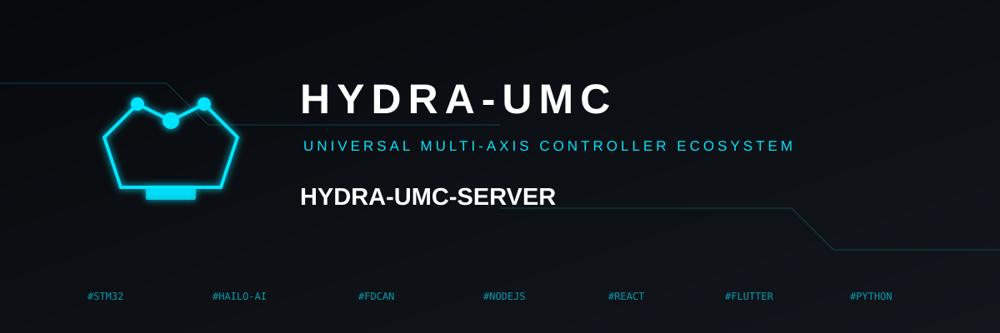

<p align="center">
  
</p>
# 🛰️ HYDRA-UMC SERVER

<p align="center">
  <a href="README.md">🇺🇸 English</a> |
  <a href="README_spa.md">🇪🇸 Español</a> |
  🇫🇷 <b>Français</b> |
  <a href="README_ita.md">🇮🇹 Italiano</a> |
  <a href="README_deu.md">🇩🇪 Deutsch</a> |
  <a href="README_zho.md">🇨🇳 简体中文</a> |
  <a href="README_jpn.md">🇯🇵 日本語</a>
</p>


### 🤖 Backend headless API/WebSocket pour la Micro-Usine Multi-Robot HYDRA-UMC

<p align="left">
  
  
  
</p>


---

## 🎯 Vue d'Ensemble

HYDRA-UMC SERVER est le backend autonome qui pilote une cellule de
micro-usine multi-robot HYDRA-UMC : un moteur Node.js/Express + WebSocket
qui possède l'état des robots, le persiste sur disque, authentifie chaque
écriture et diffuse les mises à jour en direct à chaque client connecté.
Il est fourni sans interface utilisateur ni étape de build frontend
propres - c'est un service pur API + WebSocket, conçu pour fonctionner
headless (sans navigateur, sans écran) sur la machine physiquement placée
à côté des robots (typiquement un Raspberry Pi CM5).

Il PEUT aussi, en option, servir le frontend déjà compilé de
**[HYDRA-UMC STUDIO](https://github.com/JuanenRac/HYDRA-UMC-STUDIO)**
comme fichiers statiques, pour le déploiement courant "tout sur une seule
machine, une seule origine" - exécutez **`build-frontend.sh`/`.bat`** une
fois (compile STUDIO depuis un checkout voisin et copie le résultat dans
le propre `public/` de ce dépôt, ignoré par git) et ce serveur commence à
le servir sur `/` dès son prochain démarrage. C'est ce qui permet à
HYDRA-UMC-ANDROID-CONTROL, HYDRA-UMC-IOS-CONTROL et HYDRA-UMC-DSI
d'intégrer le vrai visualiseur 3D de STUDIO dans leur propre WebView
interne, pointant vers le même ip:port de ce serveur. Entièrement
optionnel : sans exécuter ce script, ce serveur reste aussi headless que
décrit ci-dessus - `public/` n'existera simplement pas, et toutes les
routes continuent de fonctionner à l'identique.

Le même `build-frontend.sh`/`.bat` construit aussi le propre
**[`admin-ui/`](admin-ui/README.md)** de ce dépôt - un petit panneau
séparé pour administrer ce SERVEUR lui-même (appareils connectés, son
propre fichier de log, son propre port/nom, ses propres comptes
utilisateurs), servi sur `/admin`. Ce n'est délibérément PAS le contrôle
des robots (qui reste exclusif à STUDIO) - une exception ponctuelle et
explicite à la conception headless ci-dessus, pas un renoncement.

Ce projet faisait partie de **[HYDRA-UMC STUDIO](https://github.com/JuanenRac/HYDRA-UMC-STUDIO)**,
distribué comme un "monolithe hybride" : un seul processus Node.js
exécutant à la fois le moteur de contrôle des robots *et* le tableau de
bord web Vite/React (avec le middleware de développement de Vite
directement branché sur la même application Express). Ce processus a été
scindé en deux :

- **HYDRA-UMC SERVER** *(ce dépôt)* - le moteur : état des
  robots/contrôleurs, API REST + WebSocket, authentification, découverte
  mDNS, soumission de modèles. Pas d'UI, pas de bundler, pas d'étape de
  build frontend.
- **[HYDRA-UMC STUDIO](https://github.com/JuanenRac/HYDRA-UMC-STUDIO)** -
  désormais un client Vite/React pur qui communique avec ce serveur par
  le réseau, exactement comme tout autre client de cette API.

## 🧩 Pourquoi Ce Projet Existe

Séparer le moteur du tableau de bord web était un choix délibéré, pas un
refactoring gratuit :

- **Isolation des ressources.** Une vue 3D lourde qui bloque l'onglet du
  navigateur ne partage plus de processus (et donc de contention
  CPU/E-S) avec le code réellement responsable du déplacement des
  robots. Si l'UI web se bloque, ce serveur continue de répondre aux
  commandes d'arrêt d'urgence de tout autre client connecté.
- **Un vrai contrôleur headless.** Ce processus peut fonctionner sans
  jamais charger d'UI sur l'hôte - le "cerveau" d'une cellule
  industrielle n'a pas besoin d'un onglet de navigateur ouvert pour
  fonctionner. Libère RAM/CPU sur du matériel contraint (un Raspberry Pi
  CM5) pour la partie du travail qui compte réellement : cinématique et
  contrôle.
- **Cycles de vie indépendants.** L'UI web peut être redéployée,
  redémarrée ou remplacée par une build plus récente sans jamais toucher
  ce processus - aucune interruption du contrôle des robots juste pour
  livrer une correction d'UI.
- **Hébergement flexible.** Ce serveur est destiné à fonctionner sur (ou
  juste à côté de) le matériel qu'il contrôle ; le client qui l'affiche
  peut être hébergé ailleurs, joignable par le réseau exactement comme
  les autres clients distants de cette même API.

## 🔌 Surface API et WebSocket

Chaque route, le contrat des messages WebSocket, l'authentification et le
modèle d'accès distant par client sont documentés dans
**[`docs/REMOTE_API.md`](docs/REMOTE_API.md)** - la seule source de
vérité pour tout ce qui communique avec ce serveur, y compris le code
client de HYDRA-UMC STUDIO lui-même. En résumé :

- API REST sous `/api/*` - lecture/écriture des settings, commandes
  atomiques de robot (jog/play/pause/stop/tool/valve/pump/speed/vision),
  gestion des comptes, upload/download de fichiers de travail, soumission
  de modèles, métriques système, découverte.
- Un seul point de terminaison WebSocket `/ws` (jeton bearer dans la
  query string) diffusant des snapshots complets `settings` et des mises
  à jour plus légères `delta` à chaque client connecté lorsque l'état
  change.
- Authentification JWT par jeton bearer sur chaque écriture ; deux rôles
  de compte (`admin`, `operator`) filtrent les écritures de
  settings/gestion des utilisateurs par rapport à l'exploitation
  quotidienne des robots.
- Annonce mDNS/Bonjour `_hydra._tcp` pour une découverte sans
  configuration sur le réseau local, plus un simple `GET /api/hydra-info`
  pour un scan de sous-réseau.
- `GET /metrics` - format d'exposition Prometheus (`prom-client`), pour le
  tableau de bord Grafana optionnel décrit dans "📊 Supervision" ci-dessous.

CORS est activé via une liste blanche configurable
(`CORS_ALLOWED_ORIGINS`, voir "Variables d'Environnement" ci-dessous)
puisque les clients de ce serveur ne partagent plus nécessairement sa
propre origine. Non configurée, elle reste grande ouverte en dehors de
`NODE_ENV=production` (comportement actuel sans configuration pour le
développement local) ; en production, elle refuse toute requête
cross-origin de navigateur tant que la liste blanche n'est pas définie -
voir le commentaire au-dessus de `app.use(cors(corsOptions))` dans
`src/server.ts` pour le raisonnement complet.

## 💾 Données et Persistance

Tout ce que ce serveur possède vit sous `data/`, créé automatiquement au
premier démarrage :

- `data/settings.json` - l'arbre d'état complet : contrôleurs, robots,
  configuration système. Jamais servi comme fichier statique (404
  explicite) - accessible uniquement via la route authentifiée
  `/api/settings`.
- `data/users.json` - identifiants de compte (hash scrypt, salé, jamais
  en clair). Également jamais servi statiquement.
- `data/logs/server.log` - journal industriel en ajout seul de chaque
  commande.
- `data/WORKS/` - trajectoires robot enregistrées, un dossier par robot
  par défaut, servies comme de simples fichiers statiques (index +
  fichiers de travail individuels).
- `data/model_submissions.json` + les dossiers des modèles soumis
  eux-mêmes - le côté serveur du flux de
  [HYDRA-UMC-EDITOR-URDF](https://github.com/JuanenRac/HYDRA-UMC-EDITOR-URDF)
  pour "pousser un modèle de robot terminé directement dans le catalogue
  de ce serveur".

## 📂 Structure du Dépôt

```
HYDRA-UMC-SERVER/
├── src/
│   ├── server.ts       # App Express + WebSocketServer + toutes les routes /api
│   ├── kinematics.ts   # Aide de cinématique inverse pour le point de terminaison atomique de jog
│   └── users.ts        # Magasin de comptes (hachage de mot de passe scrypt)
├── data/                # État d'exécution - settings, users, logs, fichiers de travail
│   ├── settings.json
│   ├── users.json
│   ├── logs/
│   └── WORKS/
├── docs/
│   └── REMOTE_API.md    # Contrat complet : chaque route, le protocole WS, auth
├── monitoring/           # Stack Prometheus + Grafana optionnel - voir monitoring/README.md
├── scripts/
│   └── bump-version.mjs # Incrément de version type compteur kilométrique, avant chaque build
├── build.bat / build.sh # Installe les dépendances + build de production
├── dev.bat / dev.sh      # Installe les dépendances + démarre le serveur de dev
├── package.json
├── tsconfig.json
├── CHANGELOG.md
└── LICENSE
```

## 🛠️ Environnement de Développement

### Prérequis
- [Node.js](https://nodejs.org/) (v18 ou supérieur recommandé)
- npm

### Installation

```bash
npm install
```

### Variables d'Environnement

Optionnel - le serveur fonctionne sans aucune configuration, avec des
valeurs par défaut adaptées au développement pour chaque variable
ci-dessous. Définissez des valeurs réelles avant d'exposer ce serveur
au-delà d'un LAN totalement fiable - par exemple sur l'internet ouvert via
le NAT/redirection de ports d'un routeur, ce qui change le modèle de
menace de "LAN de confiance uniquement" à "accessible par n'importe qui"
(voir `.env.example`) :

- `JWT_SECRET` - signe chaque jeton de connexion. Si non définie, une
  valeur de développement fixe intégrée dans `src/server.ts` est utilisée
  à la place (convient au développement local, pas à un déploiement
  accessible hors d'un réseau de confiance). Exportez-la depuis votre
  shell, ou via votre gestionnaire de processus/conteneur préféré
  (`Environment=` de systemd, la configuration d'environnement de `pm2`,
  `-e` de Docker...).
- `NODE_ENV` - définissez `production` pour tout déploiement réel.
  Contrôle les deux comportements de repli ci-dessous (CORS ouvert,
  valeurs par défaut silencieuses) et active des avertissements de
  démarrage bien visibles si `JWT_SECRET` ou le compte `admin`/`admin`
  initial sont encore à leur valeur par défaut. Non définie (ou toute
  autre valeur) conserve le comportement permissif de développement
  actuel.
- `CORS_ALLOWED_ORIGINS` - liste d'origines séparées par des virgules
  autorisées à faire des requêtes cross-origin de navigateur vers cette
  API - le cas réel qui compte ici est HYDRA-UMC STUDIO servi depuis un
  hôte/port différent de ce serveur (ex. `https://studio.example.com`, ou
  `http://192.168.1.20:5173` en développement). Exemple :
  `CORS_ALLOWED_ORIGINS=https://studio.example.com,http://192.168.1.20:5173`.
  Si non définie : `NODE_ENV != production` autorise toute origine (aucune
  configuration nécessaire pour le développement local, comportement
  historique de ce projet) ; `NODE_ENV = production` **refuse** au
  contraire toute requête cross-origin de navigateur tant que ceci n'est
  pas défini, avec un avertissement de démarrage bien visible. Les
  clients non-navigateur (curl, HYDRA-UMC SUITE, les applications
  mobiles) ne sont jamais affectés dans un cas comme dans l'autre - CORS
  est un mécanisme propre aux navigateurs.
- `JWT_EXPIRES_IN` - durée de validité d'un jeton de connexion. Toute
  chaîne acceptée par l'option `expiresIn` propre à `jsonwebtoken`
  (`"24h"`, `"7d"`, un nombre de secondes brut...). Par défaut `30d` si
  non définie (l'hypothèse originelle de ce projet d'un LAN de confiance).
  **Un serveur accessible au-delà d'un LAN de confiance devrait définir
  ceci beaucoup plus court - `24h` est un bon point de départ** - un jeton
  longue durée qui fuite ne peut pas être révoqué individuellement, sauf
  en changeant le mot de passe de ce compte.
- `LOGIN_RATE_LIMIT_MAX` / `LOGIN_RATE_LIMIT_WINDOW_MS` - limite
  uniquement `POST /api/login` (les autres routes ne sont pas affectées).
  Par défaut 5 tentatives par 15 minutes par IP si l'une des deux n'est
  pas définie ; une limite atteinte répond `429` avec une erreur JSON
  claire, pas un `500` générique.
- `TLS_CERT_PATH` / `TLS_KEY_PATH` - définissez les **deux** pour faire
  passer le serveur (API REST + le WebSocket `/ws`, qui partage le même
  listener) de HTTP/WS en clair à HTTPS/WSS. Voir "TLS / HTTPS"
  ci-dessous. Laisser l'une ou l'autre non définie conserve le
  comportement HTTP en clair actuel sans changement.

### TLS / HTTPS

Désactivé par défaut - ce serveur a toujours fonctionné en HTTP/WS en
clair, et continue ainsi sauf activation explicite. Définissez à la fois
`TLS_CERT_PATH` et `TLS_KEY_PATH` (voir ci-dessus) vers un certificat PEM
et sa clé privée correspondante, et le listener partagé REST + WebSocket
passe à `https.createServer()` - `/ws` devient automatiquement WSS avec
lui, sans configuration séparée nécessaire. Un chemin de certificat/clé
défini mais illisible ou invalide fait échouer le démarrage bruyamment
(une vraie erreur `fs`) plutôt que de revenir silencieusement au HTTP en
clair.

Ceci importe surtout une fois que ce serveur est accessible au-delà d'un
LAN totalement fiable (ex. exposé via le NAT/redirection de ports d'un
routeur pour des tests à distance) - le HTTP en clair signifie que chaque
jeton bearer, chaque commande de robot, et la connexion admin/opérateur
elle-même traversent le réseau en clair.

Obtenir un certificat :

- **Vous possédez un domaine pointant vers ce serveur** - utilisez
  [Let's Encrypt](https://letsencrypt.org/) (ex. via
  [Certbot](https://certbot.eff.org/)) pour un certificat réel, reconnu
  par les navigateurs, gratuit et renouvelable automatiquement. Pointez
  `TLS_CERT_PATH` / `TLS_KEY_PATH` vers le `fullchain.pem` / `privkey.pem`
  résultant.
- **Tests locaux, sans domaine** - un certificat auto-signé suffit pour
  exercer le chemin de code HTTPS/WSS (les navigateurs et la plupart des
  clients HTTP avertiront/exigeront une confiance manuelle explicite, ce
  qui est normal et acceptable pour des tests) :
  ```bash
  openssl req -x509 -newkey rsa:2048 -nodes \
    -keyout key.pem -out cert.pem -days 365 -subj "/CN=localhost"
  ```
  Définissez ensuite `TLS_CERT_PATH=./cert.pem` et `TLS_KEY_PATH=./key.pem`.

### Mode Développement

Exécute le serveur API/WebSocket directement avec `tsx` (pas de bundler,
pas de frontend impliqué) :
- **Windows :** double-cliquez sur `dev.bat` ou lancez `npm run dev`
- **Linux/Mac :** lancez `./dev.sh` ou `npm run dev`

### Build de Production

Empaquette le serveur en un seul fichier déployable avec esbuild :
- **Windows :** double-cliquez sur `build.bat` ou lancez `npm run build`
- **Linux/Mac :** lancez `./build.sh` ou `npm run build`

Puis démarrez le serveur de production avec :
```bash
npm start
```

Le serveur écoute sur `0.0.0.0:3000` - accessible via
`http://localhost:3000` ou `http://<votre-ip-locale>:3000` sur le réseau
local. Tout l'état persiste dans `data/`.

### Versionnage

Chaque `npm run build` réel incrémente automatiquement le champ
`version` de `package.json` (`scripts/bump-version.mjs`, branché comme
première étape du script `build`) - un "compteur kilométrique" en base
10 : patch +1 par build, avec report sur minor (et de minor à major) au
passage de 9 plutôt que d'atteindre jamais un segment à deux chiffres
(`0.0.9` -> `0.1.0`, jamais `0.0.10`). La version en cours est lisible en
direct depuis `GET /api/hydra-info` (`appVersion`), et l'historique
complet est dans [`CHANGELOG.md`](CHANGELOG.md).

## 📊 Supervision (Optionnel)

`GET /metrics` expose le temps de fonctionnement du processus, le nombre
de clients WebSocket connectés, la latence d'écriture de `settings.json`,
les commandes atomiques de robot par type, les échecs d'authentification,
et les mêmes chiffres CPU/mémoire/température que
`GET /api/system/metrics` - le tout au format Prometheus. Une pile
Prometheus + Grafana prête à l'emploi (avec un tableau de bord de départ)
se trouve dans **[`monitoring/`](monitoring/README.md)** : `docker compose
up -d` depuis ce dossier suffit à la démarrer. Entièrement optionnel - rien
ici n'est nécessaire au fonctionnement du serveur lui-même.

## 🔗 Projets Liés

Ce projet fait partie d'un écosystème robotique plus large du même auteur (JuanenRac / Electro Hobby 3D), composé de nombreux projets couvrant le firmware, les logiciels de contrôle, les nœuds d'IA et l'outillage de flotte. À connaître, car une demande pourrait en réalité concerner l'un d'entre eux plutôt que ce dépôt.

### Directement Liés à Ce Serveur

- **[HYDRA-UMC-GATEWAY-INDUSTRIAL](https://github.com/JuanenRac/HYDRA-UMC-GATEWAY-INDUSTRIAL)** — expose l'état de ce serveur via OPC-UA/MQTT.
- **[HYDRA-UMC-DATALAKE](https://github.com/JuanenRac/HYDRA-UMC-DATALAKE)** — ingère les logs générés par ce serveur.
- **[HYDRA-UMC-TELEMETRY-COLLECTOR](https://github.com/JuanenRac/HYDRA-UMC-TELEMETRY-COLLECTOR)** — ingère les logs générés par ce serveur.
- **[HYDRA-UMC-ORCHESTRATOR](https://github.com/JuanenRac/HYDRA-UMC-ORCHESTRATOR)** — coordonne plusieurs instances de ce serveur.
- **[HYDRA-UMC-NODE-HEALING](https://github.com/JuanenRac/HYDRA-UMC-NODE-HEALING)** — coordonne plusieurs instances de ce serveur et gère leur basculement (failover).
- **[HYDRA-UMC-HIL-BRIDGE](https://github.com/JuanenRac/HYDRA-UMC-HIL-BRIDGE)** — fait le pont entre ce serveur et le jumeau numérique.
- **[HYDRA-UMC-TOOL-CLI](https://github.com/JuanenRac/HYDRA-UMC-TOOL-CLI)** — assure le DevOps de flotte contre l'API de ce serveur.

### Reste de l'Écosystème

**Plateforme HYDRA-UMC** — la cellule de micro-usine multi-robots
- **[HYDRA-UMC](https://github.com/JuanenRac/HYDRA-UMC)** — la carte mère elle-même : hôte Raspberry Pi CM5 + coprocesseur temps réel STM32H745 double cœur, orchestrant jusqu'à 8 bras robotiques distribués via CAN-OTA/SPI-OTA. Matériel et firmware propres, GPL-3.0/CERN-OHL-S v2/CC BY-SA 4.0.
- **[HYDRA-UMC STUDIO](https://github.com/JuanenRac/HYDRA-UMC-STUDIO)** — tableau de bord de contrôle web pour HYDRA-UMC : visualisation 3D multi-robots, enregistrement de cinématique/trajectoires, flashage et tests CAN-OTA pour toute la plateforme. React + Vite + Three.js - désormais un client frontend pur qui communique avec ce même serveur par le réseau, exactement comme tout autre client de la liste ci-dessous.
- **[HYDRA-UMC-ANDROID-CONTROL](https://github.com/JuanenRac/HYDRA-UMC-ANDROID-CONTROL)** — application de contrôle Android pour HYDRA-UMC via Wi-Fi/Bluetooth. Application réelle et fonctionnelle - ensemble complet de fonctionnalités de contrôle à distance, authentification JWT, stockage chiffré des identifiants.
- **[HYDRA-UMC-IOS-CONTROL](https://github.com/JuanenRac/HYDRA-UMC-IOS-CONTROL)** — application de contrôle iOS/iPadOS pour HYDRA-UMC via Wi-Fi, réalisée en Flutter (multiplateforme, vérifiable sous Windows sans Mac ; l'empaquetage final du `.ipa` nécessite toujours Xcode). Application réelle et fonctionnelle - mêmes fonctionnalités que l'application Android.
- **[HYDRA-UMC-SUITE](https://github.com/JuanenRac/HYDRA-UMC-SUITE)** — centre de commande bureau (Python/PySide6) pour l'essaim : découverte réseau multi-contrôleurs, synchronisation bidirectionnelle en direct, vrai visualiseur 3D de robots, espace de travail ancrable façon Photoshop. Réel et fonctionnel, pas un espace réservé.
- **[HYDRA-UMC-EDITOR-URDF](https://github.com/JuanenRac/HYDRA-UMC-EDITOR-URDF)** — créateur/éditeur graphique URDF de bureau (Python/PySide6) pour le catalogue de modèles de ce projet : récupère les fichiers sources depuis GitHub ou un dossier local, valide la faisabilité des degrés de liberté, édite couleur/échelle/cinématique avec aperçu 3D en direct, et transmet le résultat final directement dans le catalogue de ce serveur. Réel et fonctionnel, pas un espace réservé.
- **[HYDRA-UMC-DSI](https://github.com/JuanenRac/HYDRA-UMC-DSI)** — interface tactile native en Flutter pour l'écran tactile DSI 5"/7" propre à HYDRA-UMC (1280×720, même résolution dans les deux tailles) sur le Compute Module 5, contrôlant ce même serveur directement depuis la carte. Scaffold réel et fonctionnel avec les 6 écrans du catalogue connectés au serveur en direct ; compilation réelle de la cible Linux pas encore exécutée sur du matériel réel.

**Plateforme URTC** — le contrôleur de tête d'outil que porte chaque bras robotique HYDRA-UMC
- **[URTC](https://github.com/JuanenRac/URTC)** — Universal Robot Tool Controller : contrôleur de tête d'outil sur bus CAN basé sur STM32F303, 25 profils d'outil entièrement implémentés, mise à jour de firmware CAN-OTA.
- **[URTC Flasher](https://github.com/JuanenRac/URTC-FLASHER)** — outil de bureau de flashage CAN-OTA + puce complète SWD/JTAG pour cartes URTC (Windows/Linux).
- **[URTC Tester](https://github.com/JuanenRac/URTC-TESTER)** — outil de bureau de diagnostic en direct sur bus CAN pour cartes URTC, un panneau par profil d'outil (Windows/Linux).
- **[URTC Web Studio](https://github.com/JuanenRac/URTC-WEB-STUDIO)** — alternative basée sur navigateur aux 2 outils de bureau ci-dessus (Web Serial API + SLCAN), aucune installation locale nécessaire.

**👁️ Nœud IA de Vision (Hailo-8)**
- [HYDRA-UMC-VISION-NODE](https://github.com/JuanenRac/HYDRA-UMC-VISION-NODE)
- [HYDRA-UMC-VISION-STREAMER](https://github.com/JuanenRac/HYDRA-UMC-VISION-STREAMER)
- [HYDRA-UMC-DETECTION-HEF](https://github.com/JuanenRac/HYDRA-UMC-DETECTION-HEF)
- [HYDRA-UMC-SAFETY-ZONES](https://github.com/JuanenRac/HYDRA-UMC-SAFETY-ZONES)
- [HYDRA-UMC-VISUAL-SERVOING-API](https://github.com/JuanenRac/HYDRA-UMC-VISUAL-SERVOING-API)

**🧠 Nœud IA Cognitive (Hailo-10)**
- [HYDRA-UMC-COGNITIVE-NODE](https://github.com/JuanenRac/HYDRA-UMC-COGNITIVE-NODE)
- [HYDRA-UMC-VLA-ENGINE](https://github.com/JuanenRac/HYDRA-UMC-VLA-ENGINE)
- [HYDRA-UMC-VOICE-UI](https://github.com/JuanenRac/HYDRA-UMC-VOICE-UI)
- [HYDRA-UMC-SEMANTIC-PLANNER](https://github.com/JuanenRac/HYDRA-UMC-SEMANTIC-PLANNER)
- [HYDRA-UMC-DOCS-QA](https://github.com/JuanenRac/HYDRA-UMC-DOCS-QA)

**🐝 Orchestration et Essaim**
- [HYDRA-UMC-SWARM-SYNC](https://github.com/JuanenRac/HYDRA-UMC-SWARM-SYNC)
- [HYDRA-UMC-PATH-PLANNER-3D](https://github.com/JuanenRac/HYDRA-UMC-PATH-PLANNER-3D)
- [HYDRA-UMC-JOB-DISPATCHER](https://github.com/JuanenRac/HYDRA-UMC-JOB-DISPATCHER)

**🎮 Jumeau Numérique et Simulation**
- [HYDRA-UMC-TWIN](https://github.com/JuanenRac/HYDRA-UMC-TWIN)
- [HYDRA-UMC-PHYSICS-REPLICA](https://github.com/JuanenRac/HYDRA-UMC-PHYSICS-REPLICA)
- [HYDRA-UMC-SYNTHETIC-DATA-GEN](https://github.com/JuanenRac/HYDRA-UMC-SYNTHETIC-DATA-GEN)

**📊 Données et Analytique**
- [HYDRA-UMC-ANOMALY-DETECTOR](https://github.com/JuanenRac/HYDRA-UMC-ANOMALY-DETECTOR)
- [HYDRA-UMC-PRODUCTION-REPORTS](https://github.com/JuanenRac/HYDRA-UMC-PRODUCTION-REPORTS)

**🏭 Passerelle Industrielle**
- [HYDRA-UMC-OPCUA-SERVER](https://github.com/JuanenRac/HYDRA-UMC-OPCUA-SERVER)
- [HYDRA-UMC-MQTT-BROKER](https://github.com/JuanenRac/HYDRA-UMC-MQTT-BROKER)
- [HYDRA-UMC-MTCONNECT-ADAPTER](https://github.com/JuanenRac/HYDRA-UMC-MTCONNECT-ADAPTER)

**🛠️ Outils Complémentaires**
- [URTC-SMART-RACK](https://github.com/JuanenRac/URTC-SMART-RACK)
- [URTC-VISION-TOOL](https://github.com/JuanenRac/URTC-VISION-TOOL)
- [HYDRA-UMC-WATCH](https://github.com/JuanenRac/HYDRA-UMC-WATCH)
- [HYDRA-UMC-DASHBOARD-AI](https://github.com/JuanenRac/HYDRA-UMC-DASHBOARD-AI)

---

## 👤 Auteur

**JuanenRac** (Electro Hobby 3D)
📧 electrohobby3d@gmail.com
📺 youtube.com/@electrohobby3d

---

## 📜 Licence et Mentions de Copyright

HYDRA-UMC SERVER est (c) 2026 JuanenRac (Electro Hobby 3D). Cette mention
doit être incluse dans toute distribution de ce projet ou de travaux
dérivés.

Le code source de cette application est disponible sous la **GNU General
Public License v3.0 (GPL-3.0)**. Texte complet sur
https://www.gnu.org/licenses/gpl-3.0.html.

La documentation (ce README et ses propres traductions - `README_spa.md`,
`README_ita.md`, `README_fra.md`, `README_deu.md`, `README_zho.md`,
`README_jpn.md`) est disponible sous
**Creative Commons Attribution-ShareAlike 4.0 International (CC BY-SA
4.0)**. Texte complet sur https://creativecommons.org/licenses/by-sa/4.0/.
